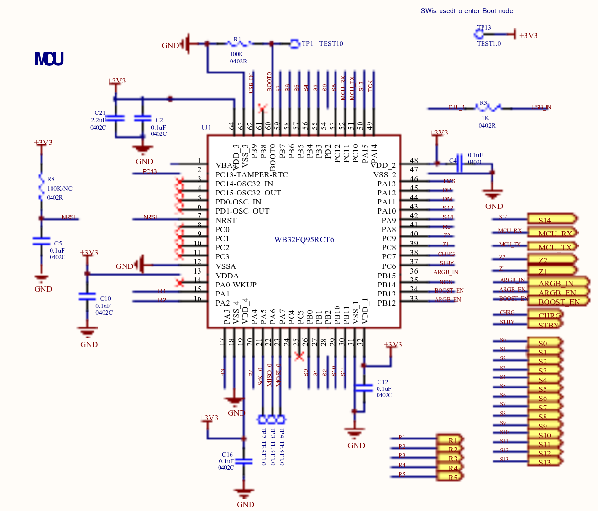
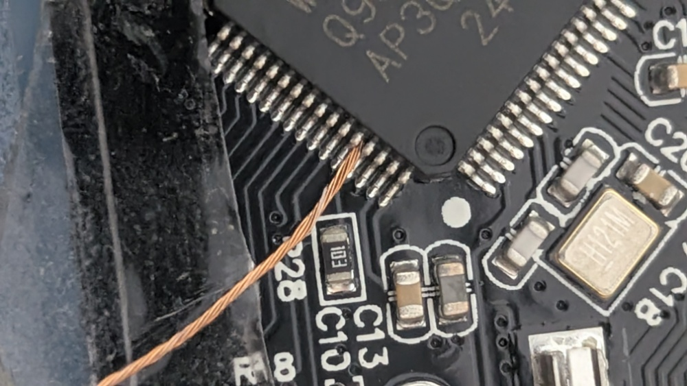
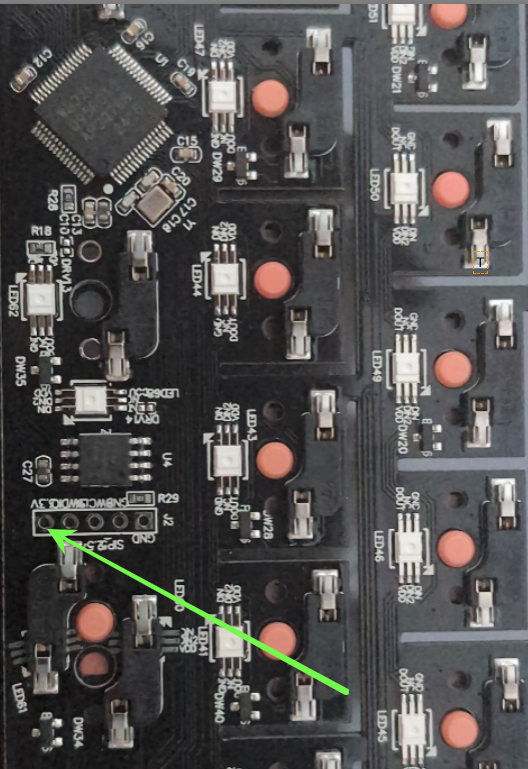

# Flashing Guide — NOIR - Spade 65

## Entering Bootloader Mode

The WB32FQ95 enters bootloader (DFU) mode by pulling the BOOT pin high to 3.3V before USB enumeration.

### Required tools
- Tweezers or a wire to bridge the pads
- USB cable
- Calm mind (this is optional, but recommended)

### PCB Schematic (BOOT circuit)



>*Source: [WB32FQ95RCT6 Schematic — Scribd](https://www.scribd.com/document/992833466/Lucky65V2-ARGB-QMK)* 

### MCU Pin Location



> **Image:** MCU Pin Location

When bridging the BOOT pad to the 3.3V pad, you will inevitably touch the adjacent pins (Pin 59 and Pin 61). This is normal and will not damage the MCU. To locate Pin 60, find the small dot in the top-left corner of the MCU package and count five pins counter-clockwise; that is Pin 60.

### VCC Pin Location



> **Image:** Bridging BOOT pad to 3.3V
---

## Step-by-Step Process

1. Unplug the keyboard from USB
2. Open the case and locate the BOOT pad on the PCB (see image above)
3. Bridge the BOOT pad to the 3.3V pad with tweezers or a wire
4. While holding the bridge, plug in the USB cable
5. Release the bridge — the board is now in bootloader mode
6. Verify with `lsusb` for WB32 DFU device

>[!IMPORTANT]
>Please make sure you remove the bridging of the BOOT pad to the 3.3V pad before flashing.
---

## Setup: wb32-dfu-updater

Install `wb32-dfu-updater_cli` via QMK's setup:

```bash
qmk setup
```

If not installed automatically, download from the [WestberryTech GitHub](https://github.com/WestberryTech/wb32-dfu-updater) and follow the build instructions there.

**Linux udev rules** (avoids needing `sudo`):

Create `/etc/udev/rules.d/50-wb32-dfu.rules`:

```
SUBSYSTEMS=="usb", ATTRS{idVendor}=="342d", MODE="0666"
```

Then reload:

```bash
sudo udevadm control --reload-rules && sudo udevadm trigger
```

---

## Flashing

Once in bootloader mode, first compile:

```bash
qmk compile -kb brian70/spade_65 -km default
```

**Recommended** — flash using `wb32-dfu-updater_cli` (confirmed working):

```bash
sudo wb32-dfu-updater_cli -s 0x08000000 -D .build/brian70_spade_65_default.bin
```

**Alternative** — `qmk flash` (untested, may work if `wb32-dfu-updater_cli` is in PATH):

```bash
qmk flash -kb brian70/spade_65 -km default
```

Flash completes automatically. Board reboots into normal mode when done.

---

## Alternative Bootloader Entry (Software)

If already running this firmware:

- Hold **Escape** while connecting USB — enters bootloader and erases persistent settings
- Press **Fn + R_Shift + Esc** — enters bootloader without USB reconnect
